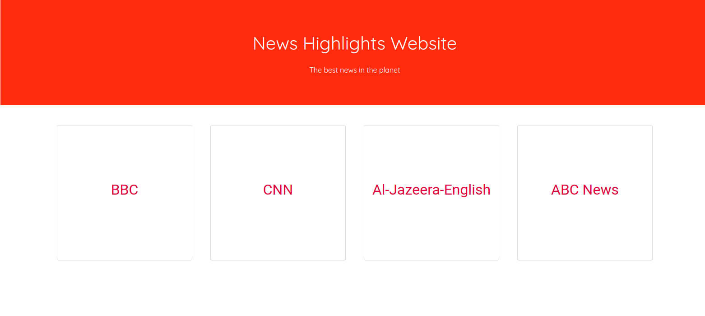

# Flask News App

### Description

---

This is a Flask app that consumes the News API and displays news depending on various sources. A user can browse various sources and view news in those sources.

---

### Author

---

This is created and maintained by: [Anthony Ng'ang'a](https://www.github.com/users/Mantongash) - A Full Stack Web Architect and creator of things.

---

### BDD

---

1. Click on a Source

- INPUT: "Click Source "
- OUTPUT: "Opens list of news articles on a new tab"

2. Click on read more

- INPUT: "Click on read more button"
- OUTPUT: "Opens an article on a new tab"

---

### Set Up Instructions

---

Open your terminal and move to a directory where you would like to store the project, eg, `cd Desktop`. Then use this command `git clone https://github.com/Mantongash/news_highlights.git` to clone it. Finally navigate to the project's root directory using `cd news_highlights`. Run `pip install` to install all the dependencies. You can now run the project in the terminal using `python3 app.py.py`

---

### Live Link

---

The life link of this app can be found [here](https://news-hig.herokuapp.com/).

---

### License

---

MIT Copyright (c) 2019 Anthony Ng'ang'a

Permission is hereby granted, free of charge, to any person obtaining a copy of this software and associated documentation files (the "Software"), to deal in the Software without restriction, including without limitation the rights to use, copy, modify, merge, publish, distribute, sublicense, and/or sell copies of the Software, and to permit persons to whom the Software is furnished to do so, subject to the following conditions:

The above copyright notice and this permission notice shall be included in all copies or substantial portions of the Software.

THE SOFTWARE IS PROVIDED "AS IS", WITHOUT WARRANTY OF ANY KIND, EXPRESS OR IMPLIED, INCLUDING BUT NOT LIMITED TO THE WARRANTIES OF MERCHANTABILITY, FITNESS FOR A PARTICULAR PURPOSE AND NONINFRINGEMENT. IN NO EVENT SHALL THE AUTHORS OR COPYRIGHT HOLDERS BE LIABLE FOR ANY CLAIM, DAMAGES OR OTHER LIABILITY, WHETHER IN AN ACTION OF CONTRACT, TORT OR OTHERWISE, ARISING FROM, OUT OF OR IN CONNECTION WITH THE SOFTWARE OR THE USE OR OTHER DEALINGS IN THE SOFTWARE.
